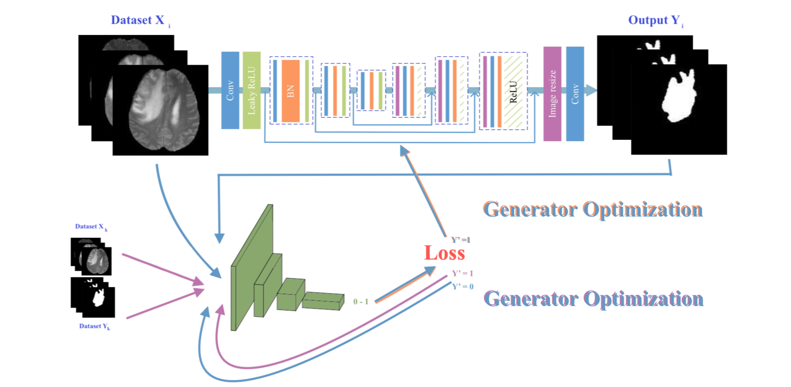

# 3D-Medical-Segmentation-GAN

|Arda Mavi|Deniz Yuret|
|:-:|:-:|
|Ayranci Anadolu High School|Koç University|

### 3D Liver Segmentation with GAN

#### This project created under `Koç University Summer Research Program`

### ! Project, README Documentation and Article are under construction!

# Contents:
[For Users](#for-users)
- [Running](#running)

[For Developers](#for-developers)
- [Model](#model)

! [Important Notes](#important-notes)

# For Users

## Running:

### Processing Dataset Command:
`python3 get_dataset.py`

### Model Training:
`python3 train.py`

# For Developers

## Model:

`Input Shape: n x 512 x 512 x 16` 
`Output Shape: n x 512 x 512 x 16`

# Important Notes
- Used Python 3.6.0 with Anaconda
- Install necessary modules with `sudo pip3 install -r requirements.txt` command.
